# FlashInfer Ragged Prefill 算子原理、CUDA 实现与优化教程

> 本文对应 XPU-OJ 20001，分析对象是本目录中的 `ragged_prefill_baseline.cu`、各阶段历史版本与最终
> `ragged_prefill_optimized.cu`。性能数字来自 `summarize.md` 和相应 CSV。最后一次已知真实线上成绩是
> 阶段 CL 的 **70.27**；最终阶段 CQ 的 **73.04 是基于 CL 逐点报告的投影，不是线上实测成绩**。

相关文件：[`题目说明`](../xpuoj_problem/problem_20001/Agent%20推理算子库优化%20-%20FlashInfer%20Ragged%20Prefill.md)、
[`优化总结`](summarize.md)、[`baseline`](ragged_prefill_baseline.cu)、
[`最终实现`](ragged_prefill_optimized.cu)、[`最终本地结果`](stage_cq_init_ref_results.csv)。

## 1. 先建立全局认识

这个题目要求实现的不是普通矩阵乘，而是 Transformer 在 prefill 阶段使用的、支持变长 batch、GQA 和
causal mask 的 attention 前向计算。

整个优化过程可以概括为三次尺度不同的跃迁：

1. **算法映射跃迁**：从一个 warp 逐 key 做标量点积，改成基于 BF16 MMA 的 FlashAttention 分块计算。
2. **执行组织跃迁**：调 Q/KV tile、warp 数、shared-memory 占用、双 KV tile 流水、任务顺序与 grid 映射。
3. **题目特化跃迁**：利用固定的 heads、head dim、GQA group、causal 模式和评测预热模型，裁掉不可达功能，
   缓存 plan，并将通用 streaming softmax 特化为固定首轮参考值版本。

从阶段 A 到 CQ 的记录延迟由 `5255.505 ms` 降到 `29.769927 ms`。两者跨越了软件和机器环境变化，不能当作
严格同环境 A/B，但可以直观看到约两个数量级的演进。严格可比的关键区间是：

| 区间 | 总延迟变化 | 说明 |
|---|---:|---|
| A -> B | 5255.505 -> 3844.152 ms | 同一 SIMT 算法上的低风险优化，1.37x |
| B -> D | 3844.152 -> 50.678 ms | 改用 BF16 MMA FlashAttention，决定性跃迁 |
| D -> F | 50.678 -> 50.637 ms | launch 收敛和单文件提交适配，性能基本不变 |
| F -> H | 50.637 -> 39.448 ms | plan cache、Q64/Q128、KV32 和 4-warp 布局 |
| H -> AJ | 39.448 -> 38.550 ms | 固定题目参数并删除通用路径，下降 2.28% |
| AK -> BL | 38.871 -> 35.928 ms | 新环境内双 KV32 流水，下降 7.57% |
| BL -> CL | 35.928 -> 33.104 ms | causal 调度、flat grid、实例裁剪后的可提交版本 |
| CL -> CQ | 33.104 -> 29.770 ms | 固定参考 softmax，下降 10.07% |

下面先推导算子语义，再走读 baseline 和最终 CUDA 主干，最后完整回顾每轮优化。

---

## 2. 题目到底要求计算什么

### 2.1 Ragged NHD 数据布局

输入张量是把 batch 中所有不同长度的序列首尾拼接起来的连续数组：

```text
Q: [total_q,  32, 128]  bf16
K: [total_kv,  4, 128]  bf16
V: [total_kv,  4, 128]  bf16
O: [total_q,  32, 128]  bf16
```

NHD 表示 token 维 N 在最外层、head 维 H 居中、head dimension D 连续。第 `n` 个 token、第 `h` 个 head
的起始地址分别是：

```text
Q/O offset = (n * 32 + h) * 128
K/V offset = (n *  4 + h) * 128
```

`qo_indptr` 和 `kv_indptr` 描述每个 batch 段的边界。例如：

```text
qo_indptr = [0, 3, 5]    -> 两段 Q 长度分别为 3、2
kv_indptr = [0, 4, 9]    -> 两段 KV 长度分别为 4、5
```

对 batch `b`：

```text
qo_begin = qo_indptr[b]
Lq       = qo_indptr[b + 1] - qo_indptr[b]
kv_begin = kv_indptr[b]
Lk       = kv_indptr[b + 1] - kv_indptr[b]
```

题目传入的 `seq_len` 只是所有段长度的上界，不能用它代替 `Lq` 或 `Lk`。这也是 ragged 实现最容易犯的第一个
错误：等长测试可能通过，真实变长测试会读错段或越界。

### 2.2 GQA 的 head 映射

题目固定 `Hq=32`、`Hkv=4`，所以一个 KV head 服务 8 个 query head：

```text
G = Hq / Hkv = 8
kv_head = qo_head / G = qo_head >> 3
```

例如 Q head 0～7 使用 KV head 0，Q head 8～15 使用 KV head 1。Q 和输出仍有 32 个 head，只有 K/V 的
head 数减少。最终 kernel 把同一 KV head 的 8 个 Q head 打包在一起，正是为了复用这层 GQA 关系。

### 2.3 Bottom-right causal mask

当 `Lq == Lk` 时，第 `t` 个 query 能看到 KV 的 `[0, t]`。但 `Lq != Lk` 时，FlashInfer 使用
bottom-right 对齐，而不是简单的 `kv_pos <= q_pos`。

第 `t` 个 query 的可见 KV 数量为：

```text
visible(b, t) = clamp(Lk - Lq + t + 1, 0, Lk)
```

等价的单元素判定是：

```text
kv_pos < Lk - Lq + q_pos + 1
```

例如 `Lq=2, Lk=4`：

```text
q_pos=0 -> visible=3 -> 可见 k[0:3]
q_pos=1 -> visible=4 -> 可见 k[0:4]
```

可以把它理解为把较短的 Q 序列右对齐到 KV 序列末端。这常见于带历史前缀的 prefill。

### 2.4 数学定义

对 batch `b`、局部 query 位置 `t`、query head `hq`，令 `hk = floor(hq / 8)`，则：

```text
s_j = dot(Q[b,t,hq,:], K[b,j,hk,:]) / sqrt(128)
p_j = exp(s_j) / sum_r exp(s_r)
O[b,t,hq,:] = sum_j p_j * V[b,j,hk,:]
```

其中 `j` 只遍历 causal mask 允许的可见前缀。每个可见 `(query,key)` 对要完成两个长度为 128 的乘加：
QK 和 PV。因此 benchmark 采用：

```text
visible_pairs  = sum_b sum_t visible(b,t)
effective_flops = 2 * visible_pairs * 32 * (128 + 128)
```

这里的 TFLOPS 是按“有效可见元素”统计的算法吞吐，不包含被 tile 尾部浪费的计算，适合比较 ragged 和 causal
形状，但不是芯片实际执行指令数。

### 2.5 接口与正确性约束

提交代码必须导出未改名的 C 符号 `run_kernel`，且参数顺序完全匹配题目。实现还必须注意：

- 只能把 `seq_len` 用于分派或 grid 上界，段长必须读 indptr；
- `run_kernel` 内不要 `cudaDeviceSynchronize()`，否则同步时间会进入计时；
- 一般用例要求 `rtol=atol=0.016` 下至少 99% 元素匹配，且不能有严重误差；
- 用例 14、15 要求 100% 元素通过；
- 输入是正态分布 BF16，不能依赖“均匀正数会让 softmax 接近前缀平均”之类的数据漏洞；
- 评测还约束源码编译时间，所以“运行快但模板实例过多”也不是有效提交。

---

## 3. Baseline CUDA 逐段解析

历史基线位于 `ragged_prefill_baseline.cu`。它的优点是结构直接、数学精确，非常适合作为正确性锚点。

### 3.1 工作划分：一个 warp 负责一个输出行

MetaX C500 暴露 64-lane warp。baseline 用 128-thread block，即每个 CTA 有两个 warp。一个 warp 负责一个：

```text
(batch, q_pos, qo_head)
```

`work` 先展开为 `batch * seq_len * 32` 个候选任务，再反解出三个坐标。ragged 段中超过真实 `Lq` 的任务直接
return。因此这种规则 grid 简单，但 ragged 情况会产生空 warp。

### 3.2 每个 lane 为什么保存两个元素

head dimension 是 128，而 warp 有 64 个 lane，所以 lane `l` 负责：

```text
d0 = l
d1 = l + 64
```

Q 的两个元素常驻 `q_fragment[2]`，输出累加器也只有 `out_acc[2]`。这样一个 warp 合起来正好覆盖整行 128 维。

### 3.3 QK 点积与 warp reduction

对每个可见 key，每个 lane 先算两个局部乘积：

```text
local = q[d0] * k[d0] + q[d1] * k[d1]
```

然后通过 32、16、8、4、2、1 的 `__shfl_down_sync` 做 64-lane 树形求和，lane 0 得到完整 dot product，再用
`__shfl_sync` 广播给全 warp。最后乘 `1/sqrt(128)`。

这个过程正确，但每个 query-key 对都要执行一轮标量 BF16->FP32 转换、乘加和 shuffle。它没有利用 MMA 单元，
所以长序列的计算量一上来，任何地址微调都不可能解决数量级瓶颈。

### 3.4 精确的 online softmax

不能先存下整行 score，因为长度可到 16384。baseline 用数值稳定的 streaming softmax，只保存：

```text
m = 当前已处理 score 的最大值
l = sum(exp(score - m))
o = sum(exp(score - m) * V)
```

加入新分数 `s` 时：

```text
m_new = max(m, s)
alpha = exp(m - m_new)
beta  = exp(s - m_new)
o_new = alpha * o + beta * V
l_new = alpha * l + beta
```

最终输出 `o/l`。这是后续 FlashAttention 的核心数学基础：K/V 可以分 tile 流式读取，无需把完整 attention
矩阵写到显存。

### 3.5 Baseline 为什么慢

主要瓶颈按重要性排序如下：

1. **没有 MMA**：QK 和 PV 都按 key 做标量运算；
2. **没有 query tile**：相邻 query 不能组成矩阵块；
3. **GQA 复用不足**：8 个 Q head 对同一个 K/V head 的工作分散在不同 warp；
4. **每 key 有 shuffle 和指数路径**：循环控制与 softmax 标量开销很重；
5. **规则上界 grid 有空任务**：ragged 尾部产生无效 warp；
6. **64 位地址重复计算**：处在最热的 key 循环里。

阶段 B 只处理了第 5、6 项和部分指数开销，因此只得到 1.37x；真正的数量级提升来自阶段 D 对前四项的重写。

---

## 4. 从标量 attention 到 MMA FlashAttention

### 4.1 最终 tile 的真实含义

最终保留两个主 kernel 实例：

```text
Q64  / W4 / KV32 / flat
Q128 / W4 / KV32 / normal
```

这里最容易误解的是 `CTA_TILE_Q`。它不是 query token 数，而是打包后的 `(query token, GQA head)` 行数：

| CTA_TILE_Q | 每 CTA 覆盖的 query token | 每个 warp 的 Q fragment |
|---:|---:|---:|
| 64 | 64 / 8 = 8 | 1 个 16-row fragment |
| 128 | 128 / 8 = 16 | 2 个 16-row fragment |

`NUM_WARPS_Q=4`，每个 warp 是 64 个线程，所以 block 为 256 threads。`NUM_MMA_KV=2`，每个 MMA tile 是
16 行，因此 `CTA_TILE_KV=2*16=32` 个 key。

head dimension 128 被拆成 8 个 K=16 的 MMA 深度块。QK 和 PV 均用 `16x16x16` BF16 MMA，累加保持 FP32。

### 4.2 一个 CTA 做什么

plan 中的每个 task 代表某个 request 的一个 query tile。再结合一个 `kv_head`，一个 CTA 计算：

```text
该 request
× 该 query token tile
× 该 KV head 对应的 8 个 Q head
× 该 KV head 的全部 causal 可见 key
```

概念上的执行流是：

```mermaid
flowchart LR
    A[plan task: request + q tile] --> B[选择一个 KV head]
    B --> C[Q: global -> register -> swizzled shared]
    C --> D[Q: shared -> MMA registers]
    D --> E[循环读取 KV32 tile]
    E --> F[BF16 MMA: Q x K^T]
    F --> G[causal mask + softmax 权重]
    G --> H[BF16 MMA: P x V]
    H --> I[FP32 numerator / denominator]
    I --> J[归一化并写回 BF16 output]
```



### 4.3 Shared memory 为什么用 union

`SharedStorageQKVO` 把 Q shared、K/V shared、同步状态和输出暂存放在一个 union 中。它们不是同时都需要：

1. 先把 Q 写入 shared 并重排；
2. Q 被加载到寄存器 fragment 后，shared 空间可以复用于 K/V；
3. K/V 以 swizzled 布局进入 shared，供 MMA 友好地读取。

这是一种生命周期复用。shared 大小按最大成员而不是所有成员之和计算，直接影响每 SM 能驻留几个 CTA。

### 4.4 Swizzle 和 fragment 的作用

MMA 对寄存器 fragment 的元素排列有固定要求。如果把 NHD 中的连续数据原样塞进 shared，多个 lane 可能冲突地
访问同一 bank，或者读到不符合矩阵指令布局的数据。代码中的 `smem_t`、`get_permuted_offset`、
`load_128b/store_128b` 和 `ldmatrix` 负责：

- 让 global load 尽量连续、对齐；
- 写入 shared 时做行列置换；
- 从 shared 装配出 MMA 期望的 A/B fragment；
- 在 64-lane warp 上匹配 xcore1000 的本地矩阵指令。

阶段中多次出现“速度很快但匹配率只有 5%～60%”或 shared/swizzle memory violation，根因通常不是 attention
公式，而是 fragment 数、warp 映射和 swizzle 地址没有同步改变。tile 参数不是改一个常量就自动合法。

### 4.5 QK 和 PV 的矩阵化

`compute_qk` 对每个 16 维深度片执行 BF16 MMA，将多个 query 行和多个 key 行同时累加到 FP32 `s_frag`。
随后 softmax 权重被转换成 BF16 fragment，`compute_sfm_v` 再用 MMA 累加 `P*V` 到 FP32 `o_frag`。

相较 baseline 的“一个 warp、一个输出行、一个 key”，MMA 版本一次指令处理一个小矩阵块，同时让同一 K/V tile
服务多个 query 行和 8 个 GQA head。这里才产生 70x 以上的主体提升。

### 4.6 Causal 边界如何减少 mask 工作

主 kernel 计算两个迭代边界：

```text
num_iterations  = 该 Q tile 最后一行最多需要多少个 KV32 tile
mask_iteration  = 从哪个 KV32 tile 开始可能越过 causal 边界
```

在 `mask_iteration` 之前的完整 tile 不需要逐元素 mask；边界 tile 才执行：

```text
valid = kv_idx + qo_len <= kv_len + q_idx && kv_idx < chunk_end
```

Q64 每 CTA 只有 8 个 query token，最终又进一步证明每个 CTA 只需对最后一个 KV tile 做 causal mask，于是阶段
CL 对 Q64 删除了 pair 中不可能触边的判断。Q128 没沿用这个改写，因为它增加了资源并使长点回退。

### 4.7 双 KV32 pair 流水

早期 MMA 主循环每 32 个 key 就完整执行一次 max、旧 accumulator 缩放、PV 和同步。阶段 AX～BH 将相邻两个
KV32 tile 合成一个 pair：

```text
QK(tile i)
QK(tile i+1)
对 64 个 score 统一处理 softmax reference
PV(tile i)
PV(tile i+1)
同时预取后续 K/V
```

这样减少 softmax 状态更新次数，并把 global->register、register->shared、MMA 和 barrier 交错起来。最终代码中
`s_frag` 与 `s_frag_next` 同时保存两个 tile 的 score；pair 循环外还有奇数尾 tile 路径。

### 4.8 CQ 的固定首轮参考 softmax

标准 online softmax 每个 tile 都要更新最大值，并在最大值变大时重缩放历史 `o_frag` 和分母 `d`。阶段 CP/CQ
注意到，若最终只需要 `O` 而不需要 LSE，则对任意有限参考值 `R`：

```text
O = sum_j exp(s_j - R) V_j / sum_j exp(s_j - R)
```

分子分母中的公共尺度会相消。最终代码取首个 KV pair 的行最大值作为 `R`：

- `INIT_REF=true`：首轮求最大值，设置 `d=0`；
- `INIT_REF=false`：后续直接计算 `exp(score-R)`；
- 不再更新最大值，也不再反复缩放历史输出累加器。

CQ 再用 `if constexpr` 把首轮和后续轮编译为两条静态路径，删除热循环里的运行时“是否初始化”判断。该改动让
CL->CQ 总时下降 10.07%，是后期最大的单项收益。

实现使用 `exp2` 指令，因此代码中的缩放量是 `sm_scale_log2 = (1/sqrt(128))*log2(e)`；
`exp2((score-R)*sm_scale_log2)` 与数学式中的 `exp((score-R)/sqrt(128))` 等价。

但它比标准 streaming softmax 弱：如果后续 score 比首轮参考值大很多，`exp(score-R)` 可能溢出。当前采用它的
证据是题目固定的 BF16 正态输入、两个种子的 15/15 回归和最大误差 `0.0078125`。若把 kernel 用于输入分布未知的
生产环境，应恢复动态最大值、周期性重标定，或加入溢出保护。

---

## 5. Host 侧 plan、调度和最终分派

### 5.1 为什么需要 plan cache

FlashInfer Python API 把调度准备放在 `wrapper.plan()` 中，计时主要覆盖 `run()`。题目 ABI 却只暴露一个
`run_kernel()`，没有 workspace 或显式 plan 接口。如果每次调用都：

- 启动 schedule kernel；
- 生成 `batch * ceil(seq_len/q_tile)` 的规则上界；
- 让主 kernel 跳过 ragged 空 tile；

短形状会被固定 launch 开销支配，长 ragged 形状也会浪费 CTA。

最终 `get_cached_plan` 在首次见到一组持久输入时把很小的两个 indptr 拷回 host，生成精确任务表，并缓存最多
128 组。cache key 包括：

```text
(q pointer, qo_indptr pointer, kv_indptr pointer,
 batch, seq_len, cta_tile_q)
```

每个 task 保存 `(request, qo_tile)`，只生成真实存在的 query tile。后续预热和计时调用直接 launch attention。

### 5.2 Longest-first 调度

causal attention 中，不同 query tile 的工作量不同：越靠后的 query 通常能看到越长的 KV 前缀。若按 tile
升序提交，最后一个 GPU wave 会集中剩余的重 CTA，其他 SM 提前空闲。

最终 plan 为每个 task 估算实际 KV32 迭代数：

```text
visible_kv = min(Lk, Lk - Lq + (tile + 1) * q_tile)
cost       = ceil(visible_kv / 32)
```

然后按 `cost` 稳定降序排序。重任务先发射，轻任务更容易填补最后的调度空洞。这不改变任一 CTA 的数值计算，
却显著改善 #3、#4、#6 等 causal 长序列的尾部利用率。

### 5.3 Flat grid

普通映射是：

```text
grid = (total_tasks, 1, 4)
blockIdx.x -> task
blockIdx.z -> kv_head
```

小 batch 下，阶段 BW 将二者展平：

```text
grid = (total_tasks * 4)
task    = blockIdx.x >> 2
kv_head = blockIdx.x & 3
```

这让同一成本层的 4 个 KV head 更均匀地进入一维调度队列。实测 `batch<=15` 受益，而 batch 16 及更大回退，
因此最终只对小 batch 使用 flat 映射。Q64 编译为专用 FlatKernel；Q128 只保留一个 normal 实例，但小 batch
可以用 `gridDim.z==1` 的方式运行 flat grid，避免额外模板实例。

### 5.4 最终 `run_kernel` 分派

最终分派规则是：

```text
seq_len == 1                         -> 256-thread V broadcast
seq_len <= 128                       -> Q64 / W4 / KV32 / flat
seq_len <= 1280 && batch <= 15       -> Q64 / W4 / KV32 / flat
seq_len == 2048 && batch == 2        -> Q64 / W4 / KV32 / flat
其他                                 -> Q128 / W4 / KV32 / normal
```

其中 Q128 在 `batch<=15` 时仍用一维 flat grid，在大 batch 时用 `(task, z=kv_head)`。这些条件不是理论上唯一的
最优式，而是对公开形状逐点 A/B 后得到的有限分派树。

### 5.5 单 token 为什么可以完全跳过 Q/K

当一段只有一个 query 和一个 KV token时，softmax 只有一个元素，权重严格等于 1：

```text
softmax([qk]) = [1]
O = V
```

所以 single-token kernel 只把 4 个 KV head 的 V 按 GQA 规则广播成 32 个输出 head，不读取 Q/K，也不做 MMA。
这是数学严格等价的特化，不是近似。

### 5.6 Plan cache 的工程边界

当前 cache 与 OJ 的“少量固定输入、充分预热、单线程调用”模型匹配，但不是通用生产级 plan 管理器：

- 首次调用含同步 D2H、`cudaMalloc` 和 H2D，依赖预热移出计时；
- 静态数组和首次初始化没有并发保护；
- cache 不回收，最多 128 组；
- key 依赖指针身份，若同一 indptr 内存原地改内容，会错误复用旧 plan；
- 若 allocator 重用完全相同的地址，也需要更强的生命周期管理。

生产集成应显式提供 plan/workspace、stream 和并发安全的缓存生命周期。

---

## 6. 最终源码阅读地图

`ragged_prefill_optimized.cu` 约 450 KiB，是把所需 xcore1000 FlashInfer/MMA 依赖内联后的单文件，不适合从第一行
顺序阅读。建议按以下顺序：

1. **从文件底部的 `run_kernel` 开始**：看题目参数检查、单 token 和 Q64/Q128 分派。
2. **向上看 `get_cached_plan`**：理解 exact ragged task、cost 排序和缓存键。
3. **看 `launch_fixed_ragged`**：把 `CTA_TILE_Q/NUM_WARPS_Q/NUM_MMA_KV` 映射为 `KernelTraits`。
4. **定位 `BatchPrefillWithRaggedKVCacheKernel/FlatKernel`**：理解 grid 到 device 主函数的入口。
5. **看 `batch_prefill_with_ragged_kv_cache_kernel_xc1000`**：这是最终 attention 热路径。
6. **再按调用关系看 helper**：`load_q_*`、K/V producer、`compute_qk`、`logits_mask`、
   `update_mdo_states_*_fixed_ref`、`compute_sfm_v` 和输出写回。
7. 其余 paged KV、xcore1500、不同 head dim 等通用代码大多是内联依赖的历史组成，不是本题实际实例。

把最终热路径压缩成伪代码如下：

```cpp
run_kernel(...) {
  validate_fixed_shape();
  if (seq_len == 1) return broadcast_v();

  q_tile = choose_64_or_128(seq_len, batch);
  plan = get_or_build_exact_cost_sorted_plan(indptrs, q_tile);
  params = make_fixed_ragged_params(plan, q, k, v, out);
  launch_q64_flat_or_q128(params);
}

attention_cta(params) {
  decode_task_and_kv_head();
  load_and_swizzle_q();
  move_q_to_mma_registers();
  prefetch_first_kv32();

  for (two kv32 tiles at a time) {
    qk_mma(tile0);
    prefetch(tile1_and_future);
    qk_mma(tile1);
    apply_only_required_causal_masks();
    exp_against_first_pair_reference();
    pv_mma(tile0);
    overlap_shared_stores_and_prefetches();
    pv_mma(tile1);
  }
  handle_odd_tail();
  normalize_fp32_accumulator();
  store_bf16_output();
}
```

---

## 7. 完整优化迭代复盘

CSV 文件名中还有 `final`、`recovery`、`smoke`、`force` 等检查点标签，例如 BB、BA、BG。它们主要用于从错误
实验恢复、强制某个分派做 A/B 或保存集成快照，不代表一条新的优化原理；下面按每次实际改变性能假设的迭代整理。

### 7.1 第一轮：A～F，从可读基线到 MMA 主干

| 阶段 | 改动 | 结果与认识 |
|---|---|---|
| A | 复核精确 baseline、修 benchmark 路径和真实 ragged FLOPs | 15/15；总时 5255.505 ms，建立可信锚点 |
| B | 固定 Hq/Hkv/D/G/scale；位移 head 映射；K/V 指针递增；每 key 一次 exp；单 token 广播 | 3844.152 ms，快 1.37x；说明标量 QK/PV 仍是数量级瓶颈 |
| C | 512-thread CTA；8 个 GQA warp 共用 shared 中的 KV32 | 代表点慢 9.5%～20.6%；L2 已承担大量复用，barrier、shared 流量和低驻留抵消收益 |
| D | 接入 xcore1000 BF16 MMA FlashAttention；Q64/KV64；FP32 softmax/PV；设备 schedule | 50.678 ms；相对 A 103.7x，是决定性架构切换 |
| E | 合并 schedule 与 chunk-size kernel；保留单 token 分派 | 50.635 ms；主要改善短点固定开销 |
| F | 内联 21 个所需依赖，移除 FlashInfer/MCTlass include 要求 | 50.637 ms；15/15，自包含提交且性能等价 |

阶段 D 调试中还有一个重要教训：device symbol 不能直接当 host pointer 使用，`cudaGetSymbolAddress` 在当时模块模式
也不可用，最后改为一次性 `cudaMalloc` 缓存真实 device pointer。异步 GPU 错误常在后续 API 才暴露，调试时必须
在最小 smoke case 后同步并检查错误。

### 7.2 第二轮：G～H，资源占用与 plan 模型

线上阶段 F 只有 59.20，暴露出“接近本地 FlashInfer”不等于接近评分公式的硬件下限。重新分析 C500：64-lane
warp、104 SM、每 SM 64 KiB shared。Q64/KV64 约占 48 KiB shared，却只有 4 warp，一个 SM 只能驻留一个 CTA。

| 阶段 | 改动 | 结果与认识 |
|---|---|---|
| G1 | 扫描 Q128，暂时保持 KV64 | L=16384 约 27.52 -> 22.98 ms；更大 Q tile 提高每 CTA 工作量 |
| G2 | 精确 plan cache，删除 ragged 空 tile和每次 schedule kernel | 15 点约 43.07 ms；缓存的是调度元数据，不是输出 |
| H | KV64 -> KV32；4 warp；Q64 每 warp 1 fragment、Q128 每 warp 2 fragment；动态分派 | 总时 39.448 ms；L=16384 21.323 ms、103.1 TFLOPS |

本轮负向搜索界定了合法布局：Q128/W4/KV64 初看 17.1 ms 但结果错误；Q64/W2/KV16 只有约 5% 匹配；Q16、
Q96/W6/KV48 出现设备越界；igroup strategy 0 无收益。任何“异常快”的结果都必须先看匹配率和严重误差。

### 7.3 第三轮：T～AJ，按题目 ABI 裁剪通用 kernel

阶段 H 线上由 59.20 提升到 63.13，方向成立。接着不再盲目改 tile，而是删除本题永远不会使用的通用功能。

| 阶段/实验 | 改动 | 决策 |
|---|---|---|
| J/M/N/O | barrier、fast-math、Q128/W8/KV32、KV64/KV48 等扫描 | 无稳定收益、错误或回退，不保留 |
| S/T | 固定 attention variant；GQA group 固定 8，用移位/掩码替代 fastdiv | 保留；多数点约 0.3%～0.6% 收益 |
| U/V/W | ctk64 生命周期、双 Q fragment 与地址实验 | 揭示旧 KV64 特化漏算第二 Q fragment，不采用错误快版本 |
| X/Y/AA | 删除恒等 logits transform、禁用 window 路径、收敛 causal mask | 性能近中性，但消除未初始化/不可达控制流，保留 |
| AC/AF | 删除 partition、LSE 和 valid-mask 路径 | 各点约 0.4%～3.3% + 0.6%～1.15%，保留 |
| AD/AE | 更激进固定 params/layout/stride | 寄存器数字下降但实际吞吐回退，撤销 |
| AI | 省略/调整 function attribute 配置 | 无收益，恢复安全配置 |
| AJ | 全量和替代种子收敛 | 38.550 ms；相对 H 下降 2.28% |

关键认识是：寄存器数不是单调目标。强制 `-max-mtreg-number=160/144` 造成 stack spill，性能回退 53%～68%；
把 Q128 改为 8 warp 虽降低单 warp 寄存器，却慢 4%～7%。必须用真实 kernel 延迟判断，而不是只看 occupancy 表。

### 7.4 第四轮：AK～BM，双 KV32 流水

环境升级为 MACA 3.7.1.5、64 GiB 完整 C500 后先重建 AK 基线，避免把跨环境绝对时间混在一起。

| 阶段 | 实验 | 结果/决策 |
|---|---|---|
| AK | 新环境重跑 AJ | 38.871 ms，作为新锚点 |
| AL | 固定 Q64/Q128 直接 launch，attribute 只配置一次 | 低于 0.5%，保留 host 收敛 |
| AM～AP | Q256/W8/KV64，从 UB、Q load 到双 fragment 逐步修复 | 错误版 14.44 ms；正确后约 20.52 ms且部分点回退，不分派 |
| AQ | QK 后过早预取 V | 中性或回退，撤销 |
| AS/AT | 新环境强制扫描 Q64/Q128 | 修正少量逐点分派，保留 |
| AU/AV | Q192/W4/KV32；launch_bounds 强制双 CTA | 前者慢 13%～23%，后者被编译器判非法，撤销 |
| AX/AY | 两个 KV32 合并一次 softmax，先全量再限定 Q128 | 正确且长点快 2%～3%，保留思路 |
| BC | 为 Q256 扩展 KV32 loader | shared/swizzle violation，撤销并 recovery |
| BD | 下一对 K/V 预取与当前 softmax/PV 重叠，删冗余 barrier | Q128 再快 4%～6%，保留 |
| BE/BF | Q64 晚预取 V；把 K shared store 提前到 PV 前 | 前者保留；后者仅 Q128 有益 |
| BH | 用完整 pair pipeline 重新启用 Q64 | Q64 再快约 2%～4%，保留 |
| BI | 显式 igroup strategy 1 | Q128 慢 0.5%～0.8%，撤销 |
| BJ/BK | Q128/W8/KV64 针对 q<kv | 普通点回退，仅 #11 有益，后续又被 Q64 替代 |
| BL | 集成、双种子和资源复核 | 35.928 ms，相对 AK 下降 7.57%；线上实测 65.33 |
| BM | 借 Q shared 空闲区做双 K/V shared buffer | barrier 少了但 shared 写流量增大，全面慢 1%～2%，撤销 |

这里再次说明“减少 barrier”不是最终目标。BM 同步更少却更慢，表明 shared 写流量、寄存器活跃范围和后端调度
同样决定吞吐。

### 7.5 第五轮：BN～CF，调度尾效应与 flat grid

这一轮先验证本地 SDK 中的 `schedbound`、direct global-to-shared 和编译器选项，再转向无需改变数值主干的调度。

| 阶段 | 改动 | 结果/决策 |
|---|---|---|
| BN | `-maca-infer-ldg` | 长点中性且有对齐警告，不依赖非默认参数 |
| BO | K/V store 外加 `schedbound` | 点间收益不一致，撤销 |
| BP | 启用未完成的 Q direct-LDGBSM | 匹配率仅 8%～56%，撤销 |
| BQ/BR | Q128/W4/KV64、Q64/W2/KV32 | 都正确但寄存器高、明显回退，淘汰 |
| BS | 每 request 内 query tile 逆序 | 重 CTA 先发，代表点全部提升 |
| BT | 所有 request 只按 tile 高度全局交错 | #11 因 Lk-Lq 不同大幅回退，不能用 tile id 近似成本 |
| BU/BV | 按真实 `visible_kv` 稳定降序；cache key 加 `ki` | 同时适配等长、q<kv 和 ragged，保留 |
| BW/BX/CA | 展平 `(task,kv_head)` 到 x 维并确定 batch 阈值 | 小 batch 受益，大 batch 回退；保留 `batch<=15` |
| CB/CC | 建立编译期 FlatKernel，再按长度组合 runtime/compile-time flat | 兼顾短点后端资源和长点调度，保留 |
| BZ/CD | single-token 512/128 threads | 都不如 256，launch 固定开销主导 |
| CE/CF | Q32/W2/KV32 仅用于超短形状 | #15 有益、#13回退；CF 局部分派后本地 33.139 ms |

CF 本地预测达到 71.71，但线上编译超时：它实例化了 Q32/Q64/Q128 normal 与 flat 等 8 个重型 kernel。本轮最
重要的工程教训是：OJ 的最优目标包含编译预算，无法编译的“最佳性能版本”没有有效成绩。

### 7.6 第六轮：CG～CL，恢复线上可编译性

| 阶段 | 改动 | 结果 |
|---|---|---|
| CG | `USE_FLAT_KERNEL` 变为编译期参数，每组 traits 只实例化会用到的 kernel | 8 个实例降到 4 个 |
| CH | 删除收益很小的 Q32 实例 | 降到 3 个 |
| CI | #11 改用已有 Q64 flat，删除 Q128/W8/KV64 | 最终只剩 Q64 flat 和 Q128 normal 两个实例 |
| CJ | 同时简化 Q64/Q128 causal mask | Q128 资源上升并回退，部分撤销 |
| CK/CL | 仅对 Q64 保留最后 tile mask 特化 | 33.104 ms；冷编译约 6.5～6.7 s；线上成功得到 70.27 |

CL 是最后一个有真实线上成绩的版本，也是后续投影的可信逐点锚点。

### 7.7 第七轮：CM～CQ，固定参考 softmax

| 阶段 | 改动 | 结果/决策 |
|---|---|---|
| CM | 排序键由连续 visible_kv 改为实际 `ceil(visible_kv/32)` | 同迭代数保持原序，#1 小幅改善，保留 |
| CN | flat 阈值由 batch 15 放宽到 16 | #7/#8 回退，恢复 15 |
| CO | 只跳过 `scale=1` 的乘法 | 新增控制流反而使多数点回退，撤销 |
| CP | 首个 KV pair 选固定参考 R，后续不更新 max、不重缩放历史状态 | 33.104 -> 30.014 ms，下降 9.33% |
| CQ | 用 `INIT_REF` 编译期特化首轮和后续轮 | 29.770 ms，再降 0.81%；两个种子 15/15 |

CQ 保持两个 attention 实例，冷编译 `6.439 s`，动态库 147664 bytes。基于 CL 真实逐点报告，预测线上总时
`33.243 -> 29.903 ms`、得分 `70.27 -> 73.04`。再次强调：这是投影，仓库没有 CQ 的新线上实测报告。

---

## 8. 性能结果应该怎样解读

### 8.1 最终 CQ 代表数据

最终默认种子 15/15 通过，`match_ratio=1.0`、严重误差 0、最大绝对误差不超过 `0.0078125`。代表点：

| 用例 | 形状 | CQ 延迟 | 有效 TFLOPS | CQ / 本地 FlashInfer |
|---:|---|---:|---:|---:|
| 1 | ragged long, B=33 | 0.763 ms | 89.3 | 0.661 |
| 2 | B=1, L=1024 | 0.104 ms | 82.8 | 0.773 |
| 3 | B=1, L=4096 | 1.079 ms | 127.4 | 0.735 |
| 4 | B=1, L=16384 | 16.189 ms | 135.8 | 0.741 |
| 6 | B=4, L=4096 | 4.249 ms | 129.4 | 0.729 |
| 8 | B=16, L=2048 | 4.482 ms | 122.7 | 0.712 |
| 14 | single token | 0.0075 ms | 极低 | 0.505 |

比值小于 1 表示 candidate 比本地 FlashInfer 快。长点 TFLOPS 高，是因为计算足以摊薄 launch、plan lookup 和
尾 tile；短点的有效吞吐低不代表 kernel 错，而是固定开销占主导。

### 8.2 本地参考不等于硬件下限

早期曾因为接近本地 FlashInfer 0.2.6 而误判“已经到顶”。线上评分实际是：

```text
S(Tk) = 100 / (1 + (Tk - Th) / (Tb - Th))
```

`Tb` 是 baseline，`Th` 是平台定义的理论/目标下限。baseline 只对应 50 分，必须继续逼近 `Th` 才能到高分。
因此优化时要同时保存：本地 A/B、真实线上逐点时间、评分曲线反推值；不能把一个本地库当作硬件 roofline。

### 8.3 为什么短 kernel 的百分比不可靠

0.008～0.03 ms 的用例接近事件计时和 launch 量化粒度。一次结果从 0.011 到 0.022 ms 看似慢 2 倍，绝对差却
只有 11 微秒。对短点应：

- 增加重复数；
- 在同一进程交替 A/B；
- 报绝对差和方差，不只报百分比；
- 避免把一次量化跳变外推成架构结论。

---

## 9. 从这次优化中可迁移的方法

### 9.1 优化顺序应从数量级瓶颈开始

推荐顺序：

```text
先证明语义正确
-> 判断是标量计算、内存还是 launch/调度瓶颈
-> 选择合适的硬件原语（这里是 MMA）
-> 再调 tile、流水和资源
-> 最后做题目特化与标量裁剪
```

阶段 B 的精细改写只有 1.37x，而阶段 D 改计算映射直接超过 70x，说明在错误的抽象层优化很勤奋也不会接近上限。

### 9.2 每轮坚持单变量和负向记录

保留 stage C、BM、CN、CO 等失败版本很有价值。它们回答了：

- GQA shared 复用是否值得？在该布局下不值得；
- 更少 barrier 是否一定快？不是；
- batch 16 是否也适合 flat？不是；
- 跳过一次无效乘法是否一定快？新增分支可能更贵；
- 更大 Q tile 是否一定好？尾块、fragment 合法性和寄存器压力会反转结果。

优化不是只积累成功技巧，而是在当前硬件、编译器和形状空间里逐步缩小可行域。

### 9.3 正确性优先于“错误吞吐”

每个新布局至少经过：

1. 边界 smoke：single token、非 2 次幂尾块、q<kv；
2. 15 个公开形状全量；
3. 替代随机种子；
4. `match_ratio`、最大绝对误差和 severe error 三重检查；
5. 再看性能。

Q256 漏算 fragment 时能跑到 14.44 ms，但匹配率只有 60.8%。这种数据只能用于定位“少做了工作”，不能进入
性能图表或优化结论。

### 9.4 Occupancy 是约束，不是目标函数

shared memory、寄存器和 warp 数共同决定驻留；驻留又只是隐藏延迟的手段。最终 Q128 只有 2 个
staticMaxWarps/PEU，却比某些更高 occupancy 方案快，因为每 warp 做了更多有效 MMA，数据复用和流水更好。

检查资源时要同时看：

- MT/ST 寄存器报告与 spill；
- dynamic shared memory；
- 每 CTA warp 数和每 SM 可驻留 CTA；
- global/shared 读写量；
- barrier 数及其两侧是否有可重叠工作；
- 最终实测吞吐。

### 9.5 调度可以不改 kernel 数学却带来大收益

causal tile 的成本天然不均匀。longest-first 和 flat grid 都不改变单个 CTA 内的 attention，却改善了 GPU wave
尾部和 head 间的负载均衡。对 ragged 算子，plan 质量往往和 kernel 内循环同等重要。

### 9.6 编译成本也是性能工程的一部分

模板为每组 tile/warp/grid 生成独立重型 kernel。CF 本地运行更快却线上编译超时；CG～CI 通过减少实例数，
既恢复可提交性，又意外找到用已有 Q64 替代专用 #11 kernel 的更好方案。应把以下指标一起纳入迭代报告：

```text
运行延迟、正确率、寄存器/shared、二进制大小、冷编译时间、kernel 实例数
```

---

## 10. 常见错误检查表

实现或改写这个算子时，优先检查以下问题：

- [ ] 是否用 indptr 读取每段真实 `Lq/Lk`，而不是假设等于 `seq_len`？
- [ ] NHD stride 是否按 token/head/dimension 正确展开？
- [ ] `kv_head = qo_head / 8` 是否正确？
- [ ] q<kv 是否使用 bottom-right causal，而不是 `kv_pos <= q_pos`？
- [ ] 非 32/64 对齐的尾 tile 是否 mask？
- [ ] 不同 Q fragment 是否都有独立 shared 地址并进入 QK/PV 循环？
- [ ] 修改 warp/tile 后，loader、swizzle、fragment 和 store 是否一起更新？
- [ ] softmax 是否避免溢出，或者明确限定了固定参考值特化的输入范围？
- [ ] 是否在计时前完成首次 plan、allocation 和 attribute 配置？
- [ ] 是否避免在 `run_kernel` 中显式同步？
- [ ] 是否在替代种子、single token、q<kv、ragged 和非 2 次幂尾块上回归？
- [ ] 是否检查了 spill、shared memory、编译时间和模板实例数？
- [ ] 声称的线上分数究竟是实测还是投影？

---

## 11. 建议的动手学习路线

1. 先在纸上手算 `Lq=2, Lk=4, Hq=8, Hkv=1, D=2` 的 bottom-right causal attention。
2. 阅读 baseline，画出一个 lane 持有的 Q/O 元素和一次 warp_sum 的数据流。
3. 在 baseline 中打印或离线验证 `work -> (batch,q_pos,head)` 的反解。
4. 阅读 stage C，理解“看似合理的 shared 复用”为何因 barrier 和驻留回退。
5. 阅读 stage D/E 外部头文件短版，先理解 host 参数和 FlashInfer dispatch，再进入自包含大文件。
6. 用最终版本只跟踪一个 Q64 CTA：8 个 token、8 个 Q head、一个 KV head、每次 KV32。
7. 对照 `stage_cq_init_ref_results.csv`，手算一个用例的 visible pairs 和有效 FLOPs。
8. 最后阅读 `summarize.md` 的负向实验，尝试在运行前预测每项实验可能受限于计算、shared、寄存器还是调度。

## 12. 最终结论

这个算子的优化本质不是某一个 CUDA 小技巧，而是四层共同收敛：

```text
正确语义：ragged + GQA + bottom-right causal
计算映射：BF16 MMA + FP32 accumulation + FlashAttention tiling
执行组织：KV32 pair pipeline + Q64/Q128 + cost-sorted plan + flat grid
提交工程：自包含源码 + plan cache + 两个模板实例 + 编译时间约束
```

baseline 提供了最清楚的数学实现，阶段 D 完成数量级的硬件映射跃迁，G～CL 逐步解决资源、流水、调度和编译
问题，CP/CQ 再利用题目输入边界重写 softmax 状态更新。最终版本的价值不仅是 `29.77 ms` 的本地结果，更是
一条可复核的优化链：每项保留改动都有正确性和 A/B 证据，每个失败方向也留下了为什么失败的边界。

进一步用于通用库时，最需要重新设计的是固定参考 softmax 的数值保护和 host plan cache 的生命周期；其余关于
MMA tiling、ragged 精确调度、causal longest-first 和模板实例预算的经验可以直接迁移到其他 attention 算子。
